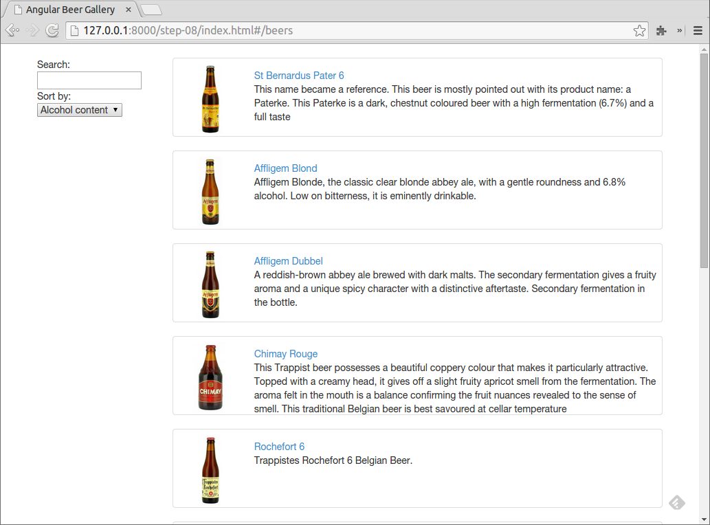
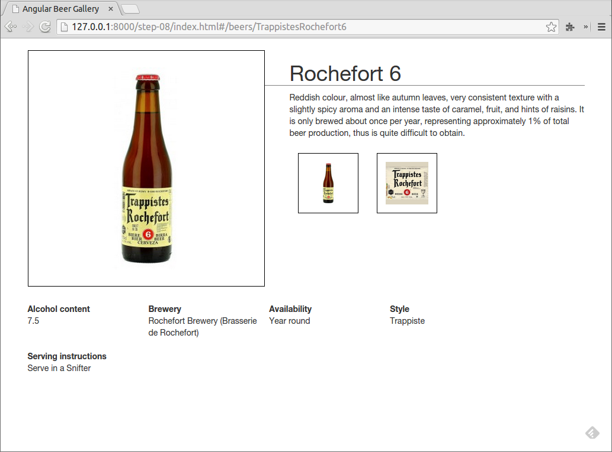

# AngularBeers - AngularJS tutorial #

We have built this [AngularBeers](https://github.com/LostInBrittany/angular-beers) tutorial as an alternative to the excellent [official AngularJS tutorial](https://docs.angularjs.org/tutorial/).

We teach web-development in an Engineering School with a rather restrictive network. In order to explain AngularJS to our students, we needed a tutorial that could be played without network acces, i.e. without Bower or Grunt. 

So we decided to build an alternative version of the tutorial that could be done even behind a very restrictive proxy. And then we thought about the subject, what would our tutorial speak about? The official one was about Android phones, and it's great, but we wanted to make us more personal... so we chose doing it about beer.

## What are the objectives of this tutorial ##

Follow the tutorial to see how Angular makes browsers smarter — without the use of native extensions or plug-ins:

+ See examples of how to use client-side data binding to build dynamic views of data that change immediately in response to user actions.
+ See how Angular keeps your views in sync with your data without the need for DOM manipulation.
+ Learn how to use dependency injection and services to make common web tasks, such as getting data into your app, easier.

When you finish the tutorial you will be able to:

+ Create a dynamic application that works in all modern browsers.
+ Use data binding to wire up your data model to your views.
+ Move application logic out of the template and into Controllers.
+ Get data from a server using Angular services.

The tutorial guides you through the entire process of building a simple application, including writing and running unit and end-to-end tests. Experiments at the end of each step provide suggestions for you to learn more about AngularJS and the application you are building.

You can go through the whole tutorial in a couple of hours or you may want to spend a pleasant day really digging into it. If you're looking for a shorter introduction to AngularJS, check out the Getting Started document.

## What do I need to use this tutorial ##

Besides a web browser and a text-editor (we suggest the excellent [Sublime Text](http://www.sublimetext.com/)), you will only need a web-server to test your code.

If you have [NodeJS](http://nodejs.org) in your system, we have put a minimalist JavaScript web-server on `./scripts/web-server.js`. To see the app running in a browser, open a separate terminal/command line tab or window, go to the project directory and then run `node ./scripts/web-server.js` to start the web server. Now, open a browser window for the app and navigate to http://localhost:8000/app/index.html to see the current state of the app.

## How is the tutorial organized ##

As the computer used for the course haven't Git, we have structurated the project to allow a Git-less use. The `app` directory is the main directory of the project, the working version of the code. The tutorial is divided in steps, each one in its own directory:

1. [Static Template](./step-01/)
1. [Angular Templates](./step-02/)
1. [Filtering Repeaters](./step-03/)
1. [Two-way Data Binding](./step-04/)
1. [XHRs & Dependency Injection](./step-05/)
1. [Templating Links & Images](./step-06/)
1. [Routing & Multiple Views](./step-07/)
1. [More Templating](./step-08/)
1. [Filters](./step-09)
1. [Event Handlers](./step-10)
1. [REST and Custom Services](./step-11)
1. [Applying Animations](./step-12)

In each step directory you have a README file that explain the objective of the step, that you will do in the working directory `app`. If you have problems or if you get lost, you also have the solution of each step in the step directories. 