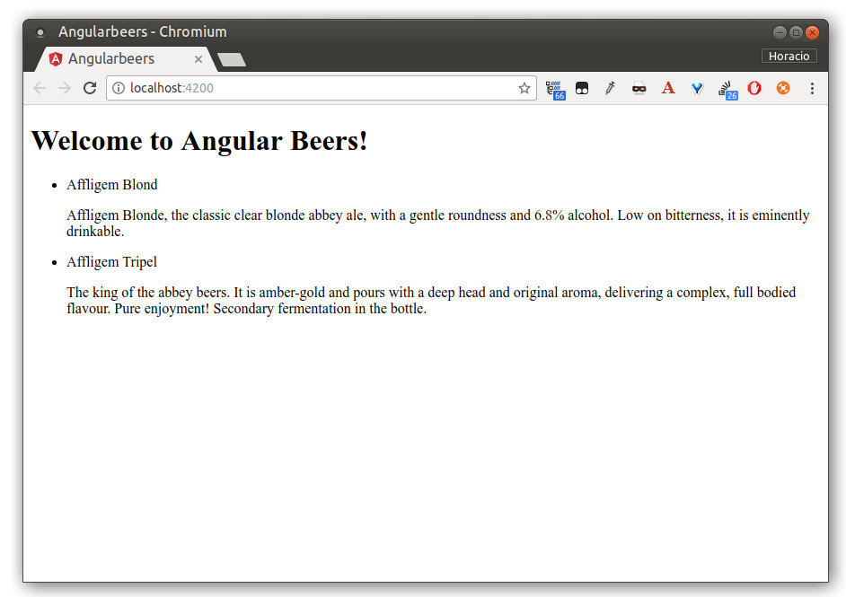

# AngularBeer - AngularJS tutorial - Step 01

In this step you're going to edit your first Angular component, the one created for you by Angular CLI, and add some static HTML as a first version of our beer catalog...

In order to illustrate how Angular enhances standard HTML, you will create a purely static HTML page and then examine how we can turn this HTML code into a template that Angular will use to dynamically display the same result with any set of data.

In this step you will add some basic information about two beers to an HTML page.

## Edit the component

As you can see, the `angularbeers` directory have several sub-directories. The most important one is `angularbeers/src`, where all your application code lays. 

Angular CLI created there first Angular component for you. This is the *root component* and it is named `app-root`. You can find it in `angularbeers/src/app/app.component.ts`.

Open the component file and change the title property from `app` to `Angular Beers`:

```typescript
import { Component } from '@angular/core';

@Component({
  selector: 'app-root',
  templateUrl: './app.component.html',
  styleUrls: ['./app.component.css']
})
export class AppComponent {
  title = 'Angular Beers';
}
```

As you can see, this component defines a template, i.e. what's it's DOM content, and a style sheet, i.e. how does it look.

Let's replace the content of the template file, `angularbeers/src/app/app.component.html`, by this simple list of two beers:

```html
<div>
  <h1>
    Welcome to {{title}}!
  </h1>
  <ul>
    <li>
      <span>Affligem Blond</span>
      <p>
        Affligem Blonde, the classic clear blonde abbey ale, with a gentle roundness and 6.8% alcohol. 
        Low on bitterness, it is eminently drinkable.
      </p>
    </li>
    <li>
      <span>Affligem Tripel</span>
      <p>
        The king of the abbey beers. It is amber-gold and pours with a deep head and original aroma, 
        delivering a complex, full bodied flavour. Pure enjoyment! Secondary fermentation in the bottle.
      </p>
    </li>
  </ul>
</div>  
```




## Additional experiments

Try adding more static HTML to `angularbeers/src/app/app.component.html`. For example:

    <p>Total number of beers: 2</p>