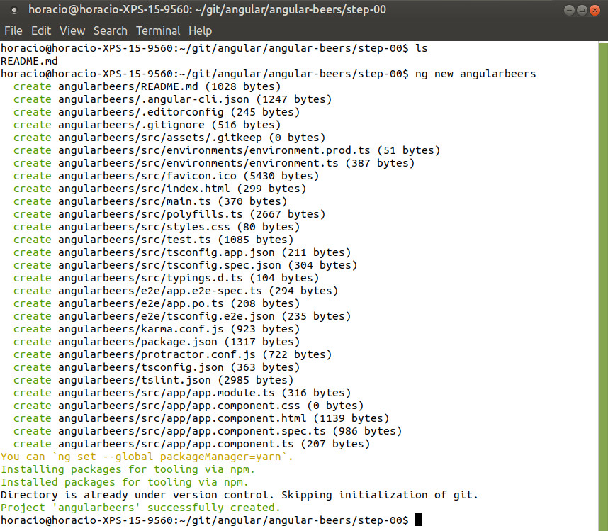

# AngularBeer - Angular tutorial - Step 03 #

We did a lot of work in laying a foundation for the app in the last step, so now we'll do something simple; we will add full text search (yes, it will be simple!).

We want to add a search box to the app, and we want the results on the beer list change according to what the user types into the search box.

## Using *impure* pipes to filter and order

In AngularJS the `ng-for` directives had some very useful `filter` and `orderBy` attributes that made the search box really easy to do.

We can still do something similar in Angular, using [pipes](https://angular.io/docs/ts/latest/guide/pipes.html). But there is a caveat, sometimes you will need these pipes to be[*impure*](https://angular.io/guide/pipes#pure-and-impure-pipes). *Pure* pipes in Angular aren't called when a property in an object has changed, only when the object reference itself changes, making them blazing fast. But when you do a filter or a sort, you need it called at every property change, so you need to use *impure* pipes, with a bigger performance cost. You have more info on the subject [here](https://angular.io/guide/pipes#appendix-no-filterpipe-or-orderbypipe).

As here we are filtering based on a text field external to the beer list, we can use a normal (*pure*) pipe.

Let's create a pipe :

`angularbeers/src/app/pipes/filter-array-pipe.ts`

```typescript
import {Pipe, PipeTransform} from '@angular/core';

// # Filter Array of Objects
@Pipe({name: 'filterArray'})
export class FilterArrayPipe implements PipeTransform {
    transform(items, args) {
        if (!args || !args[0]) {
            return items;
        } else if (items) {
            return items.filter(item => item.name.match(new RegExp(args, 'i')));
        }
    }
}
```

## Register the pipe

As any other Angular component, you need to register `FilterArrayPipe` in the main application module.

`angularbeers/src/app/app.module.ts`

```typescript
import { BrowserModule } from '@angular/platform-browser';
import { NgModule } from '@angular/core';


import { AppComponent } from './app.component';
import { BeerListComponent } from './beer-list/beer-list.component';
import { FilterArrayPipe } from './pipes/filter-array-pipe';


@NgModule({
  declarations: [
    AppComponent,
    BeerListComponent,
    FilterArrayPipe
  ],
  imports: [
    BrowserModule
  ],
  providers: [],
  bootstrap: [AppComponent]
})
export class AppModule { }
```

## Importing `FormsModule`

In Angular, in order to be able to use two-way data binding for form inputs, you need to import the `FormsModule` package in your Angular module (for more info see the [Angular official tutorial](https://angular.io/docs/ts/latest/tutorial/toh-pt1.html#!#two-way-binding) and the [official documentation for forms](https://angular.io/docs/ts/latest/guide/forms.html))

```typescript
import { BrowserModule } from '@angular/platform-browser';
import { NgModule } from '@angular/core';
import { FormsModule } from '@angular/forms';


import { AppComponent } from './app.component';
import { BeerListComponent } from './beer-list/beer-list.component';
import { FilterArrayPipe } from './pipes/filter-array-pipe';


@NgModule({
  declarations: [
    AppComponent,
    BeerListComponent,
    FilterArrayPipe
  ],
  imports: [
    BrowserModule,
    FormsModule
  ],
  providers: [],
  bootstrap: [AppComponent]
})
export class AppModule { }
```

## Use the pipe in `BeerList` 


We use some [flex-box CSS](https://css-tricks.com/snippets/css/a-guide-to-flexbox/) to divide the `BeerList` component in two more or less responsive columns the left one for the search box, the right one for the beer  list:


`angularbeers/src/app/beer-list/beer-list-component.css`

```css
.component {
  max-width: 1280px;
  margin: 0 auto;
}

.row {
  display: flex;
  flex-flow: row wrap;
}

.sidebar {
  width: 200px;
}

.main {
  max-width: 100%;
}
```

And then we modify the component template tp add a standard HTML `<input>` tag and our custom [pipe](https://angular.io/docs/ts/latest/guide/pipes.html) to process the input for the [NgFor directive](https://angular.io/docs/ts/latest/api/common/index/NgFor-directive.html) directive.

This lets a user enter search criteria and immediately see the effects of their search on the beer list.


`angularbeers/src/app/beer-list/beer-list.component.html`:

```html
<div class="container">
  <div class="row">
      <div class="sidebar">
          <!--Sidebar content-->
          Search: <input [(ngModel)]="query">
      </div>
      <div class="main">
          <!--Main content-->
          <ul>
              <li *ngFor="let beer of (beers | filterArray:query)">
                  <span>{{beer.name}}</span>
                  <p>{{beer.description}}</p>
              </li>
          </ul>
      </div>
  </div>
</div>
```


This new code demonstrates the following:

* Data-binding: This is one of the core features in Angular. When the page loads, Angular binds the name of the input box to
  a variable of the same name in the data model and keeps the two in sync.

  In this code, the data that a user types into the input box (named `query`) is immediately available as a filter input in the list repeater (`beer in beers | filter:query`). When changes to the data model cause the repeater's input to change, the repeater efficiently updates the DOM to reflect the current state of the model.

* The `FilterArrayPipe` pipe uses the `query` value to create a new array that contains only those records that match the `query`. `*ngFor` automatically updates the view in response to the changing number of phones returned by the `filter` filter. The process is completely transparent to the developer.


## Experiments

### Display Current Query

Display the current value of the query model by adding a `{{query}}` binding into the `angularbeers/src/app/beer-list/beer-list.component.html` template, and see how it changes when you type in the input box.




## Summary ##

We have now added full text search! Now let's go on to step 4 to learn how to add sorting capability to the beer app.